# 📘 Guía Maestra de Desarrollo ASP.NET Core MVC (Versión Extendida)

### Arquitectura Limpia, ADO.NET, Repository & Security

Esta guía detalla el proceso completo para construir una aplicación ASP.NET Core MVC robusta, segura y escalable, cubriendo desde la configuración inicial hasta la implementación de lógica de negocio compleja y seguridad.

---

## 🗺️ Mapa de Arquitectura (Mental)

Antes de escribir código, visualiza la separación de responsabilidades (MVC y Capas).

```mermaid
graph TD
    User((Usuario)) --> Browser[Navegador]
    Browser -- HTTP Request --> Controller[Controlador ASP.NET MVC]
    subgraph "Capa de Presentación (Web)"
        Controller -- Pide Datos --> IService[Interfaz Servicio / Repositorio]
        Controller -- Devuelve --> View[Vista Razor .cshtml]
        View -- Usa --> ViewModel[ViewModel DTO]
    end
    subgraph "Capa de Infraestructura (Datos)"
        IService -. Implementada por .-> Repository[Repositorio Concreto ADO.NET]
        Repository -- SQL --> Database[Base de Datos SQLite]
        Repository -- Mapea --> Model[Modelo de Dominio Entidad]
    end
```



---

## 🏗️ PASO 1: Configuración e Infraestructura (El "Cerebro")

**Objetivo:** Preparar el terreno para que todo funcione. Sin esto, la inyección de dependencias y la seguridad fallarán.

### 1.1. Instalación de Paquetes (NuGet)

Ejecuta estos comandos en la terminal integrada o usa el Administrador de Paquetes NuGet:

```console
dotnet add package Microsoft.Data.Sqlite (Para conectar con SQLite)
dotnet add package Microsoft.VisualStudio.Web.CodeGeneration.Design (Opcional, para scaffolding)
```

### 1.2. Configuración de `Program.cs`

Este es el punto de entrada. **El orden es vital.**

```csharp
var builder = WebApplication.CreateBuilder(args);

// A. CONFIGURAR SESIÓN (Cookie)
// Referencia TP 10 y Tema 15 (Cookies y Sesiones)
builder.Services.AddSession(options =>
{
  options.IdleTimeout = TimeSpan.FromMinutes(30); // Duración de la inactividad
  options.Cookie.HttpOnly = true; // Seguridad: La cookie no es accesible por JavaScript (protección contra XSS)
  options.Cookie.IsEssential = true; // Necesaria para el funcionamiento de la app
});

// B. PERMITIR ACCESO A SESSION EN CLASES (No Controladores)
// Permite al AuthenticationService (clase normal) acceder a HttpContext.Session.
builder.Services.AddHttpContextAccessor();

// C. REGISTRO DE INYECCIÓN DE DEPENDENCIAS (DI)
// Referencia TP 10 y Tema 15 (Inyección de Dependencias)
// AddScoped: Una instancia por petición HTTP (Request). Ideal para Repositorios.
builder.Services.AddScoped<IUserRepository, UsuarioRepository>();
builder.Services.AddScoped<IAuthenticationService, AuthenticationService>();
builder.Services.AddScoped<IProductoRepository, ProductoRepository>();
builder.Services.AddScoped<IPresupuestoRepository, PresupuestoRepository>();

// D. AGREGAR SERVICIOS MVC
builder.Services.AddControllersWithViews();

var app = builder.Build();

// E. PIPELINE DE MIDDLEWARES (¡ORDEN CRÍTICO!)
// El orden debe ser: Session -> Routing -> Authorization
if (!app.Environment.IsDevelopment())
{
  app.UseExceptionHandler("/Home/Error");
  app.UseHsts();
}

app.UseHttpsRedirection();
app.UseStaticFiles(); // Carga CSS/JS/Imágenes

app.UseSession(); // <--- 1. Primero Sesión (Cargar datos del usuario)
app.UseRouting(); // <--- 2. Luego Ruteo (Saber a dónde va)
app.UseAuthorization(); // <--- 3. Finalmente Autorización (¿Puede pasar?)

app.MapControllerRoute(
  name: "default",
  pattern: "{controller=Home}/{action=Index}/{id?}");

app.Run();
```

---

## 💾 PASO 2: Capa de Datos (El "Corazón")

**Objetivo:** Definir CÓMO se guardan los datos y QUÉ datos guardamos. Construye de abajo hacia arriba.

### 2.1. Modelos de Dominio (Entidades)

Son clases puras que representan tus tablas en la BD. **No contienen lógica de presentación (validaciones de formulario).**

- Ubicación: `Models/`
- Ejemplo: `Producto.cs`

```csharp
public class Producto
{
  // [Display] afecta a los labels en las vistas automáticamente
  [Display(Name = "ID")]
  public int IdProducto { get; set; }

  public string Descripcion { get; set; }
  public decimal Precio { get; set; }
}
```

### 2.2. Contratos (Interfaces)

Define QUÉ hace tu repositorio sin decir CÓMO. **Principio de Inversión de Dependencia (DIP).**

- Ubicación: `Interfaces/`
- Ejemplo: `IProductoRepository.cs`

```csharp
public interface IProductoRepository
{
  List<Producto> GetAll();
  Producto GetById(int id);
  void Add(Producto producto);
  void Update(Producto producto);
  void Delete(int id);
}
```

### 2.3. Implementación (Repositorios con ADO.NET)

Aquí va el SQL. Es la única parte que "toca" la base de datos. **Tema 8 (ADO.NET).**

- Ubicación: `Repositorios/`
- Patrón Clave: `using` para liberar conexiones automáticamente (`IDisposable`).
- Ejemplo: `ProductoRepository.cs`

```csharp
public class ProductoRepository : IProductoRepository
{
private readonly string connectionString = "Data Source=DB/tienda.db";

  public void Add(Producto prod)
  {
    // ... (Conexión y comando) ...

    // 3. Parámetros (¡SEGURIDAD ANTI-INYECCIÓN!)
    // Siempre usar AddWithValue para evitar la concatenación de strings en SQL.
    command.Parameters.AddWithValue("@Desc", prod.Descripcion);
    command.Parameters.AddWithValue("@Precio", prod.Precio);

    // 4. Ejecutar (NonQuery para INSERT/UPDATE/DELETE)
    command.ExecuteNonQuery();
  }

  public List<Producto> GetAll()
  {
    // ... (Conexión y comando) ...

    // 5. Ejecutar Lectura (Reader para SELECT)
    using var reader = command.ExecuteReader();

    while (reader.Read())
    {
      // Mapeo manual: BD -> Objeto (Se lee por índice o por nombre de columna)
      var p = new Producto();
      p.IdProducto = reader.GetInt32(0); // Leer por índice
      p.Descripcion = reader.GetString(1);
      // ...
    }
    return lista;
  }
}
```

---

## 🧠 PASO 3: Capa de Lógica y Seguridad

**Objetivo:** Proteger la app y manejar reglas de negocio complejas.

### 3.1. Servicio de Autenticación

Centraliza la lógica de Login/Logout/Roles.

- Ubicación: `Services/`
- Dependencias: `IUserRepository`, `IHttpContextAccessor`.
- Ejemplo: `AutenticationService.cs`

```csharp
public class AuthenticationService : IAuthenticationService
{
  private readonly IHttpContextAccessor _contextAccessor;
  private readonly IUserRepository _userRepo;

  public AuthenticationService(IHttpContextAccessor contextAccessor, IUserRepository userRepo)
  {
    _contextAccessor = contextAccessor;
    _userRepo = userRepo;
  }

  public bool Login(string user, string pass)
  {
    var usuario = _userRepo.GetUser(user, pass);
    if (usuario != null)
    {
      // Guardar en Sesión (TP 10)
      var session = _contextAccessor.HttpContext.Session;
      session.SetString("IsAuthenticated", "true");
      session.SetString("Rol", usuario.Rol); // ROL clave para autorización
      return true;
    }
    return false;
  }

  public bool HasAccessLevel(string requiredRole)
  {
    // Lógica de Autorización (TP 10)
    var userRole = _contextAccessor.HttpContext.Session.GetString("Rol");
    return userRole == requiredRole;
  }
}
```

### 3.2. ViewModels (Objetos de Transferencia)

Adaptan los datos para la Vista y agregan Validaciones. **Tema 12 (ViewModels) y Tema 13 (Validación).**

- Ubicación: `ViewModels/`
- **Regla de Oro:** Usa ViewModels para formularios, no Entidades puras.

```csharp
public class ProductoViewModel
{
  // Constructor vacío requerido por ModelBinding
  public ProductoViewModel() { }

  // Validación de obligatoriedad (Front-end y Back-end)
  [Required(ErrorMessage = "Campo obligatorio")]
  [StringLength(100)]
  public string Descripcion { get; set; }

  // Validación de rango (Regla de negocio)
  [Range(0.01, double.MaxValue, ErrorMessage = "Precio debe ser positivo.")]
  public decimal Precio { get; set; }
}
```

---

## 🎮 PASO 4: Controladores (El "Orquestador")

**Objetivo:** Unir el mundo HTTP (Vistas) con el mundo de Datos (Repositorios).

### 4.1. Estructura Básica, Inyección y Seguridad

Todo controlador de negocio debe inyectar sus dependencias y proteger sus acciones.

```csharp
public class ProductosController : Controller
{
private readonly IProductoRepository _repo;
private readonly IAuthenticationService _auth;

  // Inyección por Constructor (DI)
  public ProductosController(IProductoRepository repo, IAuthenticationService auth)
  {
    _repo = repo;
    _auth = auth;
  }

  public IActionResult Index()
  {
    // 1. Check de Seguridad (Autorización Manual - TP 10)
    if (!_auth.IsAuthenticated()) return RedirectToAction("Index", "Login");
    if (!_auth.HasAccessLevel("Administrador")) return RedirectToAction("AccesoDenegado");

    // 2. Lógica de Negocio
    var productos = _repo.GetAll();

    // 3. Devolver Vista
    return View(productos);
  }
}
```

### 4.2. Método POST (Procesar Formulario)

```csharp
    [HttpPost]
    public IActionResult Create(ProductoViewModel vm)
    {
      // 1. Validar Modelo (Validación del Lado del Servidor)
      if (!ModelState.IsValid)
      {
        // Si falla, volver a mostrar el formulario CON los errores (retorna el VM)
        return View(vm);
      }

      // 2. Mapear (ViewModel -> Entidad de Dominio)
      var producto = new Producto
      {
        Descripcion = vm.Descripcion,
        Precio = vm.Precio
      };

      // 3. Guardar en BD y Redirigir (Patrón PRG)
      _repo.Add(producto);
      return RedirectToAction("Index");
    }
```

---

## 👁️ PASO 5: Vistas (La "Cara")

**Objetivo:** Interfaz de usuario con Razor y activar validaciones.

### 5.1. Formularios Inteligentes

Usa **Tag Helpers** (`asp-for`, `asp-validation-for`) para vincular con el ViewModel.

```html
@model ProductoViewModel

<form asp-action="Create" method="post">
	<!-- Muestra errores globales (ej: validación de fecha futura) -->
	<div asp-validation-summary="ModelOnly" class="text-danger"></div>

	<div class="form-group">
		<label asp-for="Descripcion"></label>
		<input asp-for="Descripcion" class="form-control" />
		<!-- Espacio para el error específico del campo -->
		<span asp-validation-for="Descripcion" class="text-danger"></span>
	</div>

	<!-- ❗ CAMPO OCULTO para Edición: CRÍTICO -->
	<input type="hidden" asp-for="IdProducto" />
</form>

### 5.2. Activar validación cliente (jQuery) @section Scripts {
<partial name="_ValidationScriptsPartial" />
}
```

---

## 🚨 Checklist de Pánico (Errores Comunes)

1. **Error:** _"Unable to resolve service for type 'IProductoRepository'..."_

   - **Causa:** DI falló.
   - **Solución:** Falta `builder.Services.AddScoped<I...>` en `Program.cs`.

2. **Error:** El Dropdown explota (`NullReferenceException`) al enviar datos inválidos.

   - **Causa:** El `SelectList` no fue recargado en el método `POST` después de que la validación falló.
   - **Solución:** Recargar la lista de productos en el controlador antes de `return View(model)`.

3. **Error:** La sesión se cierra o no se lee.

   - **Causa:** Orden incorrecto en `Program.cs`.
   - **Solución:** `app.UseSession()` debe ir **antes** de `app.UseRouting()`.

4. **Error:** El login funciona, pero las rutas con seguridad no.

   - **Causa:** La lógica `_auth.HasAccessLevel("Admin")` no se está ejecutando o el Rol no se guardó correctamente en la Sesión en `AuthenticationService.Login()`.

5. **Error:** Edito un producto pero se crea uno nuevo o da error.
   - **Causa:** Falta el `<input type="hidden" asp-for="IdProducto" />` en la vista `Edit.cshtml`. El ID llega como 0.
